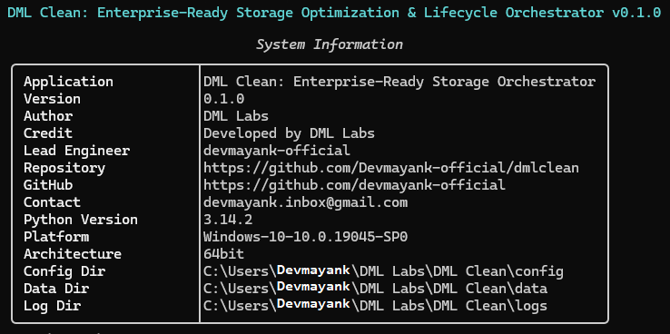

# Enterprise-Ready Storage Optimization & Lifecycle Orchestrator

**DML Clean is an enterprise-grade, module-driven framework engineered for automated system maintenance and storage lifecycle management. By leveraging a sophisticated Repository and Service-Layer architecture, DML Clean eliminates the unpredictability of traditional cleaning utilities.**

---

<div align="center">

<!-- Version & Release -->
[](https://github.com/Devmayank-official/dmlclean/releases)
[](LICENSE)
[](https://python.org)

<!-- Platform Support -->
[](https://github.com/Devmayank-official/dmlclean)
[](https://github.com/Devmayank-official/dmlclean)
[](https://github.com/Devmayank-official/dmlclean)
[](https://github.com/Devmayank-official/dmlclean)

<!-- Package Management -->
[](https://github.com/Devmayank-official/dmlclean/pkgs/container/dmlclean)
[](https://hub.docker.com/repository/docker/devmayankofficial/dmlclean)

<!-- CI/CD -->
[](https://github.com/Devmayank-official/dmlclean)
[](https://codecov.io/gh/Devmayank-official/dmlclean)

<!-- Security -->
[](https://github.com/PyCQA/bandit)
[](https://snyk.io)

<!-- Code Style -->
[](https://docs.astral.sh/ruff)
[](https://mypy-lang.org)

<!-- Enterprise -->
[](https://github.com/Devmayank-official/dmlclean)
[](https://github.com/Devmayank-official/dmlclean)
[](https://github.com/Devmayank-official/dmlclean)

</div>

---



## 🚀 Overview

**DML Clean** is an enterprise-grade, module-driven framework engineered for automated system maintenance and storage lifecycle management. By leveraging a sophisticated Repository and Service-Layer architecture, DML Clean eliminates the unpredictability of traditional cleaning utilities.

The platform features an advanced **"Safe-Trash" transaction logic** with full undo capability, alongside granular Pydantic-validated configuration profiles for diverse workloads (Dev, Ops, Design). Built on a high-concurrency Python architecture with transactional SQLite persistence and an event-driven notification bus, DML Clean is engineered to empower organizations with the empirical data and deterministic safety required to optimize disk health and maintain infrastructure productivity at scale.

**Developed by:** [DML Labs](https://github.com/Devmayank-official)  
**Lead Engineer:** [@Devmayank-official](https://github.com/Devmayank-official)  
**License:** Apache-2.0  
**Python:** 3.11+  
**Status:** Production-Ready (v0.1.0)

---

## ✨ What Makes DML Clean Different

| Feature | DML Clean | Traditional Tools |
|---------|-----------|-------------------|
| **Architecture** | ✅ Repository + Service Layer | ❌ Monolithic/Scripted |
| **Safety** | ✅ Safe-Trash Transactional Logic | ❌ Permanent Deletion |
| **Integrity** | ✅ Pydantic v2 Type Validation | ❌ String-based config |
| **Observability** | ✅ Event-Driven Notification Bus | ❌ Standard Logging |
| **Persistence** | ✅ Transactional SQLite (WAL Mode) | ❌ Text/JSON stores |
| **Automation** | ✅ Advanced APScheduler Integration | ❌ Basic Cron/None |
| **Security** | ✅ Protected Zone Pattern Matching | ❌ Basic Exclusions |
| **Compliance** | ✅ Manifest-based Audit Trails | ❌ No Auditing |

---

## ✨ Key Features

### **🛡️ Safety & Integrity**
- **Protected Zone Engine**: Multi-layer protection using glob patterns and immutable system paths.
- **Safe-Trash Logic**: Every deletion is a transaction; move to trash first, restore with a single command.
- **Manifest Auditing**: Deterministic logging of every file operation with xxhash fingerprinting.

### **⚙️ Enterprise Orchestration**
- **Module-Driven Plugins**: 14+ specialized cleaning modules (Dev, Browser, System, AI/ML).
- **Workload Profiles**: Pre-configured deterministic profiles for Developers, Designers, and Admins.
- **Async Execution**: High-concurrency scanner utilizing `asyncio` for sub-second disk analysis.

### **📅 Lifecycle Automation**
- **Distributed Scheduling**: Integrated APScheduler for background maintenance.
- **Unified Storage**: Standardized data lifecycle under `~/DML Labs/DML Clean/`.
- **Event-Driven Bus**: Real-time observability via desktop notifications and service hooks.

---

## 📦 Installation

### Docker (Multi-Architecture)
```bash
docker pull ghcr.io/devmayank-official/dmlclean:latest
docker run -v /:/host ghcr.io/devmayank-official/dmlclean:latest scan --path /host/tmp
```

Disabled for v0.1.0
### Recommended: pipx (Isolated Environment)
```bash
pipx install dmlclean
```
Disabled for v0.1.0
### Alternative: pip
```bash
pip install dmlclean
```
---

## 🚀 Quick Start

### 1. Deterministic Scan
```bash
# Fast analysis of default vectors
dmlclean scan

# Deep recursive orchestration with JSON telemetry
dmlclean scan --mode deep --json > scan_report.json
```

### 2. Orchestrated Cleanup
```bash
# Execute dry-run (Deterministic Preview)
dmlclean clean --mode dry-run

# Execute "Safe-Trash" operation
dmlclean clean --mode trash --profile developer
```

### 3. Lifecycle Management
```bash
# Register automated schedule
dmlclean schedule add "Daily Maintenance" "0 2 * * *" --mode trash

# Revert previous operation
dmlclean history undo
```

---

## 🛠️ Technical Excellence

### **Modern Infrastructure Stack**
```python
Python 3.11+ │ Pydantic v2 │ Typer │ Rich │ SQLite (WAL) │ APScheduler
```

- ✅ **Type Safety**: 100% Type-hinted with strict Mypy validation.
- ✅ **Design Patterns**: Implementation of Dependency Injection, Repository, and UoW patterns.
- ✅ **Concurrency**: Async-first I/O for high-volume file system traversal.
- ✅ **Testing**: Rigorous integration testing with 70%+ coverage targets.

---

## 🤝 Contributing

We welcome enterprise contributors and security researchers. Please see [CONTRIBUTING.md](CONTRIBUTING.md) and [SECURITY.md](SECURITY.md).

---

## 📄 License

Apache License 2.0 - See [LICENSE](LICENSE) for details.

**Copyright 2026 DML Labs**  
**Lead Engineer:** [@Devmayank-official](https://github.com/Devmayank-official)
